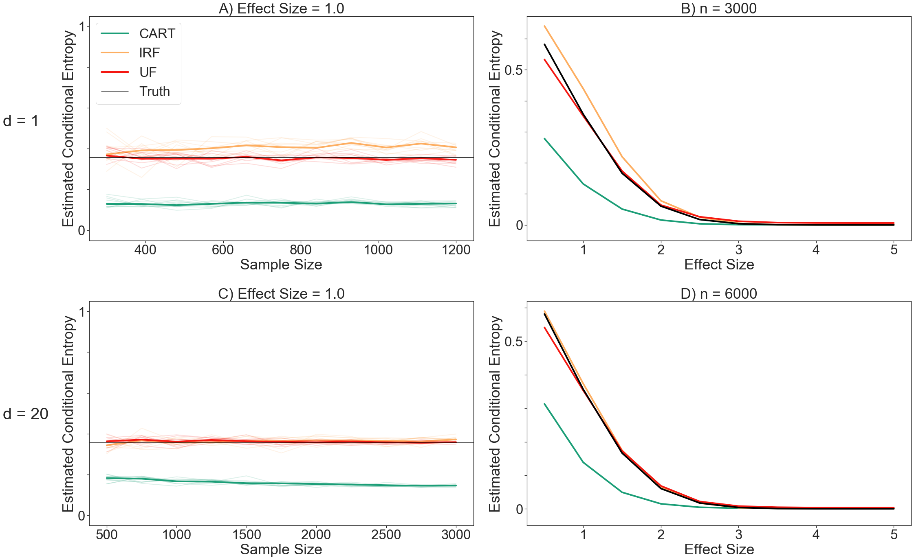

```python
import numpy as np
import seaborn as sns
import matplotlib.pyplot as plt
import pickle

from sklearn.ensemble import RandomForestClassifier
from sklearn.calibration import CalibratedClassifierCV
from sklearn.model_selection import train_test_split
from sklearn.ensemble import BaggingClassifier
from sklearn.tree import DecisionTreeClassifier

# from tqdm.notebook import tqdm
from joblib import Parallel, delayed
from scipy.stats import entropy, norm
from scipy.integrate import quad
```


```python
def uf(X, y, n_estimators = 300, max_samples = .4, base = np.exp(1), kappa = 3):
    
    # Build forest with default parameters.
    model = BaggingClassifier(DecisionTreeClassifier(), 
                              n_estimators=n_estimators, 
                              max_samples=max_samples, 
                              bootstrap=False)
    model.fit(X, y)
    n = X.shape[0]
    K = model.n_classes_
    _, y = np.unique(y, return_inverse=True)
    
    cond_entropy = 0
    for tree_idx, tree in enumerate(model):
        # Find the indices of the training set used for partition.
        sampled_indices = model.estimators_samples_[tree_idx]
        unsampled_indices = np.delete(np.arange(0,n), sampled_indices)
        
        # Randomly split the rest into voting and evaluation.
        total_unsampled = len(unsampled_indices)
        np.random.shuffle(unsampled_indices)
        vote_indices = unsampled_indices[:total_unsampled//2]
        eval_indices = unsampled_indices[total_unsampled//2:]
        
        # Store the posterior in a num_nodes-by-num_classes matrix.
        # Posteriors in non-leaf cells will be zero everywhere
        # and later changed to uniform.
        node_counts = tree.tree_.n_node_samples
        class_counts = np.zeros((len(node_counts), K))
        est_nodes = tree.apply(X[vote_indices])
        est_classes = y[vote_indices]
        for i in range(len(est_nodes)):
            class_counts[est_nodes[i], est_classes[i]] += 1
        
        row_sums = class_counts.sum(axis=1) # Total number of estimation points in each leaf.
        row_sums[row_sums == 0] = 1 # Avoid divide by zero.
        class_probs = class_counts / row_sums[:, None]
        
        # Make the nodes that have no estimation indices uniform.
        # This includes non-leaf nodes, but that will not affect the estimate.
        class_probs[np.argwhere(class_probs.sum(axis = 1) == 0)] = [1 / K]*K
        
        # Apply finite sample correction and renormalize.
        where_0 = np.argwhere(class_probs == 0)
        for elem in where_0:
            class_probs[elem[0], elem[1]] = 1 / (kappa*class_counts.sum(axis = 1)[elem[0]])
        row_sums = class_probs.sum(axis=1)
        class_probs = class_probs / row_sums[:, None]
        
        # Place evaluation points in their corresponding leaf node.
        # Store evaluation posterior in a num_eval-by-num_class matrix.
        eval_class_probs = class_probs[tree.apply(X[eval_indices])]
        # eval_class_probs = [class_probs[x] for x in tree.apply(X[eval_indices])]
        eval_entropies = [entropy(posterior) for posterior in eval_class_probs]
        cond_entropy += np.mean(eval_entropies)
      
    return cond_entropy / n_estimators
```


```python
def CART_estimate(X, y, n_trees = 300, bootstrap = True):
    model = RandomForestClassifier(bootstrap = bootstrap, n_estimators =n_trees)
    model.fit(X, y)
    class_counts = np.zeros((X.shape[0], model.n_classes_))
    for tree_in_forest in model:
        # get number of training elements in each partition
        node_counts = tree_in_forest.tree_.n_node_samples
        # get counts for all x (x.length array)
        partition_counts = np.asarray([node_counts[x] for x in tree_in_forest.apply(X)])
        # get class probability for all x (x.length, n_classes)
        class_probs = tree_in_forest.predict_proba(X)
        # get elements by performing row wise multiplication
        elems = np.multiply(class_probs, partition_counts[:, np.newaxis])
        # update counts for that tree
        class_counts += elems
    probs = class_counts/class_counts.sum(axis=1, keepdims=True)
    entropies = -np.sum(np.log(probs)*probs, axis = 1)
    # convert nan to 0
    entropies = np.nan_to_num(entropies)
    return np.mean(entropies)
```

## Simulate Data and Conditional Entropy Prediction


```python
def generate_data(n, d, mu = 1):
    n_1 = np.random.binomial(n, .5) # number of class 1
    mean = np.zeros(d)
    mean[0] = mu
    X_1 = np.random.multivariate_normal(mean, np.eye(d), n_1)
    
    X = np.concatenate((X_1, np.random.multivariate_normal(-mean, np.eye(d), n - n_1)))
    y = np.concatenate((np.repeat(1, n_1), np.repeat(0, n - n_1)))
  
    return X, y
```

## Compute True Conditional Entropy


```python
def true_cond_entropy(mu, base = np.exp(1)):
    def func(x):
        p = 0.5 * norm.pdf(x, mu, 1) + 0.5 * norm.pdf(x, -mu, 1)
        return -p * np.log(p) / np.log(base)
    
    H_X = quad(func, -20, 20)
    H_XY = 0.5*(1.0 + np.log(2 * np.pi)) / np.log(base)
    H_Y = np.log(2.0) / np.log(base)
    # I_XY = H_X - H_XY = H_Y - H_YX
    return H_Y - H_X[0] + H_XY
```

## Conditional Entropy versus Sample Size


```python
def format_func(value, tick_number):
    epsilon = 10 ** (-5)
    if np.absolute(value) < epsilon:
        return "0"
    if np.absolute(value - 0.5) < epsilon:
        return "0.5"
    if np.absolute(value - 1) < epsilon:
        return "1"
    else:
        return ""
```


```python
def plot_cond_entropy_by_n(ax, num_plotted_trials, d, mu, algos, panel):
        
    sample_sizes = np.array(pickle.load(open('output/sample_sizes_d_%d.pkl' % d, 'rb')))
    for j, algo in enumerate(algos):
        result = pickle.load(open('output/%s_by_n_d_%d.pkl' % (algo['label'], d), 'rb'))
        # Plot the mean over trials as a solid line.
        ax.plot(sample_sizes,
                np.mean(result, axis = 1).flatten(), 
                label = algo['label'], 
                linewidth = 4, 
                color = algo['color'])
        # Use transparent lines to show other trials.
        for t in range(num_plotted_trials):
            ax.plot(sample_sizes, 
                    result[:, t].flatten(),  
                    linewidth = 2, 
                    color = algo['color'],
                    alpha = 0.15)
    
    truth = true_cond_entropy(mu)
    ax.axhline(y = truth, linestyle = '-', color = "black", label = "Truth")
        
    ax.yaxis.set_major_formatter(plt.FuncFormatter(format_func))
    ax.set_xlabel("Sample Size")
    ax.set_ylabel("Estimated Conditional Entropy")
    ax.set_title("%s) Effect Size = %.1f" % (panel, mu))
    ax.set_ylim(ymin = -0.05, ymax = 1.05)
```

## Conditional Entropy Estimates versus Effect Size


```python
def plot_cond_entropy_by_mu(ax, d, n, algos, panel):
    
    mus = pickle.load(open('output/mus.pkl', 'rb'))
    for j, algo in enumerate(algos):
        result = pickle.load(open('output/%s_by_mu_d_%d.pkl' % (algo['label'], d), 'rb'))
        # Plot the mean over trials as a solid line.
        ax.plot(mus,
                np.mean(result, axis = 1).flatten(), 
                label = algo['label'], 
                linewidth = 4, 
                color = algo['color'])
    
    truth = [true_cond_entropy(mu) for mu in mus]
    ax.plot(mus, truth, label = 'Truth', linewidth = 4, color = 'black')

    ax.yaxis.set_major_formatter(plt.FuncFormatter(format_func))
    ax.set_ylim(ymin = -.05)
    ax.set_title("%s) n = %d" % (panel, n))
    ax.set_xlabel("Effect Size")
    ax.set_ylabel("Estimated Conditional Entropy")
```


```python
def plot_fig2(num_plotted_trials, d1, d2, n1, n2, effect_size, algos):
    sns.set(font_scale = 3)
    sns.set_style("ticks")
    plt.rcParams["font.family"] = "sans-serif"
    plt.rcParams['figure.figsize'] = [30, 20]
    fig, axes = plt.subplots(2, 2)
    
    plot_cond_entropy_by_n(axes[0, 0], num_plotted_trials, d1, effect_size, algos, "A")
    plot_cond_entropy_by_mu(axes[0, 1], d1, n1, algos, "B")
    
    plot_cond_entropy_by_n(axes[1, 0], num_plotted_trials, d2, effect_size, algos, "C") 
    plot_cond_entropy_by_mu(axes[1, 1], d2, n2, algos, "D")
    
    axes[0,0].legend(loc = "upper left")
    
    fig.text(-0.05, 0.27, 'd = %d' % d2, ha='left', va='center', fontsize = 40)
    fig.text(-0.05, 0.77, 'd = %d' % d1, ha='left', va='center', fontsize = 40)
    
    plt.subplots_adjust(left=-1)
    plt.tight_layout()
    plt.savefig("fig2.pdf", bbox_inches = "tight")
    plt.show()
```


```python
def get_cond_entropy_vs_n(mean, d, num_trials, sample_sizes, algos):
    
    def worker(t):
        X, y = generate_data(elem, d, mu = mean)
        
        ret = []
        for algo in algos:
            ret.append(estimate_ce(X, y, algo['label']))

        return tuple(ret)
    
    output = np.zeros((len(algos), len(sample_sizes), num_trials))
    for i, elem in enumerate(sample_sizes):
        results = np.array(Parallel(n_jobs=-2)(delayed(worker)(t) for t in range(num_trials)))
        for j in range(len(algos)):
            output[j, i, :] = results[:, j]
        
    pickle.dump(sample_sizes, open('output/sample_sizes_d_%d.pkl' % d, 'wb'))
    for j, algo in enumerate(algos):
        pickle.dump(output[j], open('output/%s_by_n_d_%d.pkl' % (algo['label'], d), 'wb'))
        
    return output
```


```python
def estimate_ce(X, y, label):
    if label == "CART":
        return CART_estimate(X, y)
    elif label == "IRF":
        frac_eval = 0.3
        irf = CalibratedClassifierCV(base_estimator=RandomForestClassifier(n_estimators = 300), 
                                     method='isotonic', 
                                     cv = 5)
        # X_train, y_train, X_eval, y_eval = split_train_eval(X, y, frac_eval)
        X_train, X_eval, y_train, y_eval = train_test_split(X, y, test_size=frac_eval)
        irf.fit(X_train, y_train)
        p = irf.predict_proba(X_eval)
        return np.mean(entropy(p.T, base = np.exp(1)))
    elif label == "UF":
        return uf(X, y, base = np.exp(1), kappa = 3)
    else:
        raise ValueError("Unrecognized Label!")
```


```python
def get_cond_entropy_vs_mu(n, d, num_trials, mus, algos):
    
    def worker(t):
        X, y = generate_data(n, d, mu = elem)
        
        ret = []
        for algo in algos:
            ret.append(estimate_ce(X, y, algo['label']))

        return tuple(ret)
    
    output = np.zeros((len(algos), len(mus), num_trials))
    for i, elem in enumerate(mus):
        results = np.array(Parallel(n_jobs=-2)(delayed(worker)(t) for t in range(num_trials)))
        for j in range(len(algos)):
            output[j, i, :] = results[:, j]
    
    pickle.dump(mus, open('output/mus.pkl', 'wb'))
    for j, algo in enumerate(algos):
        pickle.dump(output[j], open('output/%s_by_mu_d_%d.pkl' % (algo['label'], d), 'wb'))
        
    return output
```

## Run Experiments and Plot


```python
# Data.
mus = [i * 0.5 for i in range(1, 11)]
effect_size = 1
d1 = 1
d2 = 20
n1 = 3000
n2 = 6000
num_trials = 20
num_plotted_trials = 10
sample_sizes_d1 = range(300, 1201, 90)
sample_sizes_d2 = range(500, 3001, 250)

# Fake params.
# mus = [i * 0.5 for i in range(1, 3)]
# effect_size = 1
# d1 = 1
# d2 = 3
# n1 = 100
# n2 = 110
# num_trials = 2
# num_plotted_trials = 2
# sample_sizes_d1 = range(100, 120, 10)
# sample_sizes_d2 = range(100, 130, 10)

# Algorithms.
algos = [
    {
        'label': 'CART',
        'title': 'CART Forest',
        'color': "#1b9e77",
    },
    {
        'label': 'IRF',
        'title': 'Isotonic Reg. Forest',
        'color': "#fdae61",
    },
    {
        'label': 'UF',
        'title': 'Uncertainty Forest',
        'color': "#F41711",
    },
]
```

### Estimated H(Y | X) versus n, d = 1


```python
get_cond_entropy_vs_n(effect_size, d1, num_trials, sample_sizes_d1, algos)
```


    array([[[0.11531492, 0.12614917, 0.10951659, 0.16597578, 0.11556062,
             0.13167037, 0.17639872, 0.11354992, 0.14769783, 0.15812563,
             0.11996737, 0.11760983, 0.13101291, 0.12200204, 0.11819547,
             0.12709021, 0.12509639, 0.13178788, 0.10248092, 0.12818901],
            [0.13142034, 0.14251231, 0.15198568, 0.12000107, 0.11461527,
             0.12536103, 0.15320228, 0.11827305, 0.12372805, 0.11625201,
             0.09464998, 0.15393911, 0.11868656, 0.12261573, 0.12820936,
             0.11739039, 0.11908068, 0.15701508, 0.15714886, 0.11008266],
            [0.11645786, 0.14440698, 0.11432916, 0.14875411, 0.12007003,
             0.13815392, 0.16187852, 0.11619756, 0.09779648, 0.1325331 ,
             0.1175964 , 0.10192648, 0.09491442, 0.12138364, 0.12857796,
             0.10712378, 0.13351463, 0.10693493, 0.10156227, 0.15286283],
            [0.1122352 , 0.11795279, 0.14030047, 0.12494898, 0.1448296 ,
             0.12837264, 0.13258533, 0.12781358, 0.10668283, 0.1148067 ,
             0.12538079, 0.1288965 , 0.13285781, 0.11498174, 0.15121998,
             0.15041471, 0.12705795, 0.12032311, 0.13230326, 0.15631626],
            [0.1377288 , 0.12811444, 0.13084635, 0.17156227, 0.13671451,
             0.13028479, 0.13595044, 0.12191235, 0.15258926, 0.12319573,
             0.13610983, 0.12985302, 0.14904262, 0.13811359, 0.11186032,
             0.12868188, 0.14108856, 0.11687904, 0.13977323, 0.14454003],
            [0.10862509, 0.13129169, 0.1205064 , 0.13244406, 0.1539019 ,
             0.11335685, 0.14266439, 0.14371139, 0.13315833, 0.14656328,
             0.1614812 , 0.134764  , 0.14251573, 0.15307869, 0.13830702,
             0.13635453, 0.12297403, 0.10303324, 0.14965461, 0.12319159],
            [0.15295079, 0.11904339, 0.13551526, 0.12415587, 0.11673702,
             0.13945358, 0.1392821 , 0.13501536, 0.12554711, 0.13397343,
             0.11083663, 0.13748513, 0.1161745 , 0.13268125, 0.12659236,
             0.15975514, 0.14680825, 0.13372566, 0.10470387, 0.11941768],
            [0.12935386, 0.14054228, 0.1449532 , 0.14454229, 0.15117793,
             0.14245997, 0.13011017, 0.1636219 , 0.13988764, 0.15349618,
             0.1363341 , 0.11045306, 0.12111404, 0.13489562, 0.15058078,
             0.12689155, 0.12494668, 0.14912613, 0.13335009, 0.12551044],
            [0.12392593, 0.12744855, 0.13947273, 0.12734546, 0.12410288,
             0.12589977, 0.13638502, 0.1377312 , 0.11689695, 0.12984189,
             0.12109328, 0.11861954, 0.12528191, 0.13523023, 0.12459708,
             0.10821035, 0.13699195, 0.12094117, 0.1295592 , 0.13642339],
            [0.12453656, 0.13916347, 0.13160897, 0.11929937, 0.10917123,
             0.1432487 , 0.14490932, 0.13653026, 0.10945884, 0.1259499 ,
             0.13598732, 0.13953981, 0.13881173, 0.1250607 , 0.12105515,
             0.12656567, 0.1207453 , 0.12529865, 0.14260568, 0.12938587],
            [0.11050921, 0.13561242, 0.14291521, 0.12342625, 0.1106114 ,
             0.14406554, 0.11719958, 0.13098728, 0.12055062, 0.12811068,
             0.12300242, 0.16148192, 0.12503112, 0.14906014, 0.13773094,
             0.11134515, 0.13257913, 0.13248415, 0.15652951, 0.12597907]],
    
           [[0.40575422, 0.34167622, 0.28879208, 0.37752683, 0.39008416,
             0.48167995, 0.41455857, 0.3486533 , 0.49990451, 0.35322345,
             0.30807716, 0.34274942, 0.39900808, 0.38871075, 0.31501526,
             0.30640635, 0.35908355, 0.37392582, 0.34854714, 0.39543147],
            [0.4138731 , 0.46230551, 0.42481848, 0.38351821, 0.34351732,
             0.36240617, 0.37604491, 0.40983526, 0.37255083, 0.25874531,
             0.31561336, 0.40415717, 0.37971303, 0.50438017, 0.48407788,
             0.29039345, 0.39030628, 0.4233217 , 0.46626734, 0.36793834],
            [0.43589622, 0.38994215, 0.30886242, 0.3797012 , 0.39974181,
             0.4332023 , 0.44278121, 0.37336409, 0.33981731, 0.41915872,
             0.43513527, 0.40686036, 0.34669761, 0.31970207, 0.41239482,
             0.41548416, 0.39013676, 0.3909112 , 0.38892148, 0.43662464],
            [0.4071396 , 0.38445079, 0.45831174, 0.39054723, 0.40429188,
             0.35677242, 0.43412952, 0.35486517, 0.40598982, 0.3674786 ,
             0.44774878, 0.42771196, 0.44147648, 0.39827835, 0.42609038,
             0.40816776, 0.40015259, 0.41903392, 0.318011  , 0.38667241],
            [0.41772961, 0.38964725, 0.45679836, 0.42227796, 0.41780242,
             0.37956393, 0.42097228, 0.44019995, 0.43806412, 0.37782294,
             0.41482185, 0.40127716, 0.39999449, 0.43928352, 0.43479193,
             0.4188843 , 0.37449088, 0.45705255, 0.44059047, 0.37287483],
            [0.36459384, 0.38332425, 0.40960843, 0.41429929, 0.42713821,
             0.3552262 , 0.4194995 , 0.45404287, 0.36610238, 0.45274787,
             0.42140375, 0.42152784, 0.42672983, 0.40311442, 0.41350465,
             0.37695091, 0.38387964, 0.39289728, 0.42372865, 0.43717621],
            [0.43631331, 0.43371725, 0.41116909, 0.3711067 , 0.42013832,
             0.43637268, 0.41775395, 0.42246017, 0.38712198, 0.4418666 ,
             0.36486439, 0.41405191, 0.35246046, 0.40038152, 0.40493349,
             0.42953127, 0.41557405, 0.42021773, 0.327158  , 0.36941526],
            [0.39600364, 0.41915098, 0.45614313, 0.41842514, 0.4515665 ,
             0.42480982, 0.45106488, 0.45121998, 0.40030772, 0.44434043,
             0.41569586, 0.38964698, 0.4294954 , 0.42992624, 0.44545767,
             0.4069047 , 0.39181656, 0.46021384, 0.42475798, 0.45623447],
            [0.39704826, 0.39702011, 0.44961127, 0.4169226 , 0.37184368,
             0.38900967, 0.40473195, 0.39408261, 0.37775602, 0.41561316,
             0.44151134, 0.37145151, 0.37337597, 0.42591053, 0.43441821,
             0.4129481 , 0.41453932, 0.40079202, 0.41256791, 0.41591412],
            [0.42766561, 0.48379076, 0.43645189, 0.39161867, 0.39916809,
             0.44895559, 0.43837631, 0.43346029, 0.36710235, 0.40408686,
             0.38535763, 0.49308883, 0.42234267, 0.43665786, 0.40522773,
             0.43350182, 0.40939877, 0.40650449, 0.44838242, 0.42394556],
            [0.36540629, 0.41547274, 0.40189128, 0.42072158, 0.39722233,
             0.39107262, 0.3696539 , 0.42658126, 0.39221661, 0.3917096 ,
             0.40658641, 0.44014867, 0.382458  , 0.4206764 , 0.45272389,
             0.38008794, 0.40054198, 0.41527941, 0.45488244, 0.40591428]],
    
           [[0.35403   , 0.40186877, 0.32261867, 0.40155164, 0.35116128,
             0.40959358, 0.40838374, 0.35067595, 0.41257402, 0.39249252,
             0.30448917, 0.35078673, 0.37500753, 0.32951312, 0.34435651,
             0.36763434, 0.38173477, 0.35822903, 0.32517502, 0.37672738],
            [0.35857574, 0.40119883, 0.3816919 , 0.34506813, 0.33070202,
             0.35816328, 0.36035605, 0.38126244, 0.35725398, 0.30470459,
             0.3046211 , 0.38875625, 0.318842  , 0.37798476, 0.36897801,
             0.29239305, 0.32149294, 0.34391257, 0.38960201, 0.32528881],
            [0.37723059, 0.37426974, 0.30166196, 0.37341384, 0.35198184,
             0.372189  , 0.3819672 , 0.36012323, 0.31907205, 0.35513416,
             0.35571733, 0.3405198 , 0.31003536, 0.32095799, 0.37082818,
             0.32677198, 0.37143605, 0.33521504, 0.34757906, 0.37054282],
            [0.35510764, 0.30760345, 0.38999262, 0.34309433, 0.37774508,
             0.31602333, 0.34543956, 0.31226545, 0.33586216, 0.34386262,
             0.36253602, 0.33230731, 0.38072436, 0.34795742, 0.37112676,
             0.38092027, 0.34630765, 0.3370814 , 0.36370789, 0.37680416],
            [0.36230068, 0.35150004, 0.36572769, 0.38943824, 0.34077969,
             0.32814935, 0.36373083, 0.36433114, 0.37208097, 0.35867858,
             0.35972081, 0.35844587, 0.39051603, 0.35950217, 0.34743753,
             0.36282143, 0.33450832, 0.37444134, 0.35597131, 0.34851562],
            [0.33439198, 0.33806169, 0.33568757, 0.34395414, 0.36123527,
             0.30269712, 0.33715392, 0.36975001, 0.32532314, 0.36841863,
             0.354744  , 0.3249551 , 0.36992262, 0.34494367, 0.33963144,
             0.32870324, 0.34167593, 0.3334142 , 0.35876978, 0.34118911],
            [0.4020927 , 0.35043443, 0.35778063, 0.33619082, 0.35149251,
             0.36109262, 0.37401105, 0.36588268, 0.35914822, 0.36806601,
             0.34282822, 0.35098739, 0.32843609, 0.35156911, 0.35964827,
             0.39284778, 0.3679126 , 0.32314011, 0.33624248, 0.35782735],
            [0.33191081, 0.34729745, 0.35200192, 0.32437378, 0.37166337,
             0.35243841, 0.37749619, 0.39517206, 0.32689936, 0.36958319,
             0.36832997, 0.33487595, 0.34576011, 0.34284969, 0.368696  ,
             0.35862888, 0.35353289, 0.36649098, 0.35802535, 0.34079215],
            [0.34287252, 0.35193019, 0.35206348, 0.33534929, 0.3197371 ,
             0.32937101, 0.34282454, 0.34738698, 0.35040894, 0.34237615,
             0.35566086, 0.31783515, 0.35498637, 0.34035861, 0.35342038,
             0.35885599, 0.36502692, 0.34430113, 0.34247087, 0.34736099],
            [0.33701647, 0.3728144 , 0.3497042 , 0.35721916, 0.34197131,
             0.34871539, 0.35950305, 0.34164338, 0.32767699, 0.34373444,
             0.35085351, 0.37060323, 0.36446666, 0.34883688, 0.32469645,
             0.36402313, 0.3627697 , 0.36021618, 0.3713438 , 0.36191847],
            [0.30885497, 0.36226659, 0.36632548, 0.358518  , 0.33061899,
             0.33771024, 0.32540725, 0.34571504, 0.32919382, 0.34384683,
             0.33274835, 0.36619757, 0.35865923, 0.37310372, 0.35563907,
             0.30857396, 0.34969311, 0.35049018, 0.37998517, 0.3215474 ]]])


### Estimated H(Y | X) versus mu, d = 1


```python
# Estimate conditional entropy vs mu.
get_cond_entropy_vs_mu(n1, d1, num_trials, mus, algos)
```


    array([[[2.85772370e-01, 2.64193414e-01, 2.75200502e-01, 2.74844310e-01,
             2.86832617e-01, 2.74728432e-01, 2.57690224e-01, 2.73308832e-01,
             2.87230752e-01, 2.85190503e-01, 2.81143645e-01, 2.79625071e-01,
             2.84884748e-01, 2.77591835e-01, 2.74674657e-01, 2.84409959e-01,
             2.82868520e-01, 2.88856208e-01, 2.71449607e-01, 2.69015129e-01],
            [1.31485064e-01, 1.29925104e-01, 1.27657006e-01, 1.21207417e-01,
             1.31027630e-01, 1.33365774e-01, 1.34915212e-01, 1.25845888e-01,
             1.27335081e-01, 1.39179585e-01, 1.30726068e-01, 1.41192994e-01,
             1.43135614e-01, 1.35902272e-01, 1.18593726e-01, 1.30375769e-01,
             1.42943435e-01, 1.33400192e-01, 1.22875357e-01, 1.34406478e-01],
            [5.29668170e-02, 5.15493551e-02, 5.04751720e-02, 5.89071588e-02,
             5.40847593e-02, 5.08236268e-02, 4.27999044e-02, 5.24505673e-02,
             5.41577863e-02, 5.27421158e-02, 5.29329761e-02, 4.94576400e-02,
             4.86235338e-02, 5.45887829e-02, 4.81240253e-02, 5.00666592e-02,
             5.03885759e-02, 4.32905040e-02, 5.39070930e-02, 4.88302140e-02],
            [1.34447851e-02, 1.86582441e-02, 1.65056799e-02, 1.50286629e-02,
             1.64032804e-02, 1.69737912e-02, 1.59183778e-02, 1.36766740e-02,
             1.57699563e-02, 1.52232708e-02, 1.47863806e-02, 1.94822034e-02,
             1.57350023e-02, 1.47608071e-02, 1.73931789e-02, 1.97199578e-02,
             1.36691615e-02, 1.11693695e-02, 1.73322249e-02, 1.24993780e-02],
            [6.17377013e-03, 2.78058232e-03, 2.24880347e-03, 3.06905692e-03,
             2.86593127e-03, 1.52261446e-03, 3.84089710e-03, 5.39888140e-03,
             3.77103032e-03, 3.79916500e-03, 3.63842039e-03, 2.97225085e-03,
             4.35200685e-03, 1.63368087e-03, 4.68957088e-03, 4.29718973e-03,
             4.79877157e-03, 4.85537582e-03, 2.91838868e-03, 1.61759558e-03],
            [3.70460157e-04, 1.38216723e-03, 1.35905065e-03, 6.81355710e-04,
             5.04746737e-04, 8.71298096e-04, 1.11645873e-03, 8.35384810e-04,
             8.04731093e-04, 7.23692350e-04, 8.08494674e-04, 1.21325239e-03,
             4.77970033e-04, 6.97310515e-04, 6.86632097e-04, 5.48929813e-04,
             7.17050302e-04, 6.63296858e-04, 6.78397015e-04, 1.32037942e-04],
            [2.11154418e-05, 7.82483853e-05, 2.22900164e-04, 0.00000000e+00,
             0.00000000e+00, 5.29865802e-04, 7.54179411e-06, 2.18321337e-04,
             5.20200557e-04, 0.00000000e+00, 5.25669698e-04, 3.55261413e-04,
             3.21422372e-04, 0.00000000e+00, 0.00000000e+00, 6.26753233e-04,
             3.89511899e-04, 6.14794838e-04, 0.00000000e+00, 5.70605138e-04],
            [1.07405499e-04, 0.00000000e+00, 0.00000000e+00, 1.77160571e-04,
             0.00000000e+00, 5.18968237e-04, 0.00000000e+00, 0.00000000e+00,
             0.00000000e+00, 0.00000000e+00, 0.00000000e+00, 4.97314658e-05,
             0.00000000e+00, 0.00000000e+00, 0.00000000e+00, 4.41211923e-04,
             0.00000000e+00, 0.00000000e+00, 1.91192371e-05, 0.00000000e+00],
            [0.00000000e+00, 0.00000000e+00, 0.00000000e+00, 0.00000000e+00,
             7.64459178e-06, 0.00000000e+00, 0.00000000e+00, 0.00000000e+00,
             0.00000000e+00, 0.00000000e+00, 0.00000000e+00, 0.00000000e+00,
             0.00000000e+00, 0.00000000e+00, 0.00000000e+00, 0.00000000e+00,
             0.00000000e+00, 0.00000000e+00, 0.00000000e+00, 0.00000000e+00],
            [0.00000000e+00, 0.00000000e+00, 0.00000000e+00, 0.00000000e+00,
             0.00000000e+00, 0.00000000e+00, 0.00000000e+00, 0.00000000e+00,
             0.00000000e+00, 0.00000000e+00, 0.00000000e+00, 0.00000000e+00,
             0.00000000e+00, 0.00000000e+00, 0.00000000e+00, 0.00000000e+00,
             0.00000000e+00, 0.00000000e+00, 0.00000000e+00, 0.00000000e+00]],
    
           [[6.43159194e-01, 6.37748205e-01, 6.27243683e-01, 6.42322903e-01,
             6.43512563e-01, 6.54027389e-01, 6.22233874e-01, 6.42246762e-01,
             6.51383877e-01, 6.38256287e-01, 6.36777414e-01, 6.38123812e-01,
             6.48677269e-01, 6.44098136e-01, 6.38427641e-01, 6.35963570e-01,
             6.48087281e-01, 6.45231064e-01, 6.36734107e-01, 6.38661231e-01],
            [4.74809736e-01, 4.31274326e-01, 4.45338052e-01, 3.89633592e-01,
             4.08632755e-01, 4.46359556e-01, 4.38599847e-01, 4.23960938e-01,
             4.43876890e-01, 4.53707014e-01, 4.41812893e-01, 4.38686734e-01,
             4.46760420e-01, 4.54491885e-01, 4.22256696e-01, 4.68290593e-01,
             4.45156364e-01, 4.45672336e-01, 4.25713901e-01, 4.26040444e-01],
            [2.44262738e-01, 2.12640504e-01, 2.12771013e-01, 2.38783693e-01,
             2.38304595e-01, 2.39896138e-01, 1.99552983e-01, 2.23636400e-01,
             2.22499284e-01, 2.07259596e-01, 2.09326151e-01, 2.10784799e-01,
             2.14128888e-01, 2.21831247e-01, 2.08463974e-01, 2.14249458e-01,
             2.18616581e-01, 2.23535648e-01, 2.26738449e-01, 2.03799187e-01],
            [8.62328520e-02, 7.66042453e-02, 6.72476838e-02, 8.07623127e-02,
             8.84342713e-02, 6.79843025e-02, 9.49275007e-02, 6.96697820e-02,
             6.85929199e-02, 7.55990138e-02, 6.96620193e-02, 1.03713320e-01,
             7.66285478e-02, 8.55631335e-02, 8.24932183e-02, 8.37145469e-02,
             5.53314927e-02, 6.88283293e-02, 7.04457969e-02, 8.19486854e-02],
            [3.00451000e-02, 2.89817058e-02, 2.49661296e-02, 3.03112959e-02,
             3.63893721e-02, 1.08148689e-02, 2.18128013e-02, 2.57110176e-02,
             2.66805317e-02, 2.69566572e-02, 3.22450423e-02, 2.57029642e-02,
             1.66293361e-02, 1.68760891e-02, 3.82294415e-02, 2.79593578e-02,
             2.02499676e-02, 1.58444000e-02, 2.71744946e-02, 1.23872180e-02],
            [1.63563961e-02, 3.59006258e-03, 4.65039231e-03, 4.93579519e-03,
             1.06208825e-02, 9.49709300e-03, 7.57244286e-04, 8.29682525e-03,
             5.64802548e-03, 4.46712070e-04, 1.55691569e-02, 5.78335662e-03,
             6.29401148e-04, 1.25921764e-03, 1.25713618e-03, 2.03012724e-03,
             7.01402287e-04, 4.94768706e-03, 7.83855894e-03, 0.00000000e+00],
            [0.00000000e+00, 6.14040266e-04, 8.14142491e-04, 0.00000000e+00,
             0.00000000e+00, 8.51552782e-04, 0.00000000e+00, 2.90027050e-05,
             4.81689955e-05, 6.15769406e-06, 0.00000000e+00, 1.60302387e-05,
             6.17529890e-04, 0.00000000e+00, 0.00000000e+00, 9.02564168e-04,
             0.00000000e+00, 3.91276226e-03, 0.00000000e+00, 1.03633829e-03],
            [7.70115138e-04, 0.00000000e+00, 2.48226443e-05, 5.39172051e-04,
             0.00000000e+00, 7.34880807e-04, 0.00000000e+00, 0.00000000e+00,
             0.00000000e+00, 0.00000000e+00, 0.00000000e+00, 0.00000000e+00,
             0.00000000e+00, 0.00000000e+00, 0.00000000e+00, 6.15769406e-06,
             0.00000000e+00, 0.00000000e+00, 0.00000000e+00, 0.00000000e+00],
            [0.00000000e+00, 0.00000000e+00, 0.00000000e+00, 0.00000000e+00,
             0.00000000e+00, 0.00000000e+00, 0.00000000e+00, 0.00000000e+00,
             0.00000000e+00, 0.00000000e+00, 0.00000000e+00, 0.00000000e+00,
             0.00000000e+00, 0.00000000e+00, 0.00000000e+00, 0.00000000e+00,
             0.00000000e+00, 0.00000000e+00, 0.00000000e+00, 0.00000000e+00],
            [0.00000000e+00, 0.00000000e+00, 0.00000000e+00, 0.00000000e+00,
             0.00000000e+00, 0.00000000e+00, 0.00000000e+00, 0.00000000e+00,
             0.00000000e+00, 0.00000000e+00, 0.00000000e+00, 0.00000000e+00,
             0.00000000e+00, 0.00000000e+00, 0.00000000e+00, 0.00000000e+00,
             0.00000000e+00, 0.00000000e+00, 0.00000000e+00, 0.00000000e+00]],
    
           [[5.39877090e-01, 5.22786724e-01, 5.29549159e-01, 5.31131398e-01,
             5.39660428e-01, 5.38175881e-01, 5.21555875e-01, 5.29725417e-01,
             5.36127011e-01, 5.38498935e-01, 5.36684486e-01, 5.28130698e-01,
             5.36883801e-01, 5.31968559e-01, 5.31757405e-01, 5.31824698e-01,
             5.30146140e-01, 5.34596118e-01, 5.32881347e-01, 5.32565168e-01],
            [3.63165230e-01, 3.49253501e-01, 3.40505093e-01, 3.32249356e-01,
             3.50946436e-01, 3.41621198e-01, 3.51222875e-01, 3.30370769e-01,
             3.45310413e-01, 3.64649811e-01, 3.51422225e-01, 3.54942696e-01,
             3.59366649e-01, 3.54307613e-01, 3.51042171e-01, 3.64991774e-01,
             3.69850174e-01, 3.44794128e-01, 3.44227857e-01, 3.44908420e-01],
            [1.73380231e-01, 1.69068674e-01, 1.69970095e-01, 1.81202187e-01,
             1.72369614e-01, 1.85647389e-01, 1.57482862e-01, 1.85451976e-01,
             1.67996859e-01, 1.76386718e-01, 1.76066619e-01, 1.74844191e-01,
             1.66151288e-01, 1.86110502e-01, 1.66626014e-01, 1.73489329e-01,
             1.78790849e-01, 1.62535119e-01, 1.71552582e-01, 1.73436661e-01],
            [6.40107552e-02, 6.23634994e-02, 5.61320110e-02, 6.62377759e-02,
             6.85529379e-02, 5.93756129e-02, 7.86812651e-02, 6.14966717e-02,
             6.91529964e-02, 6.26855458e-02, 6.44293030e-02, 6.93301342e-02,
             6.17692930e-02, 6.76966350e-02, 6.39439675e-02, 6.52235334e-02,
             5.66376525e-02, 5.52572208e-02, 6.28099965e-02, 6.33792495e-02],
            [2.95983109e-02, 2.47075698e-02, 2.13017942e-02, 2.75453867e-02,
             2.75715242e-02, 1.84228761e-02, 2.22979032e-02, 2.89089831e-02,
             2.61729054e-02, 2.81914449e-02, 2.85443343e-02, 2.65369303e-02,
             2.88448859e-02, 2.22832928e-02, 3.31116889e-02, 3.04583733e-02,
             2.55462305e-02, 2.31268291e-02, 2.44846031e-02, 2.43493441e-02],
            [1.61276709e-02, 1.44544788e-02, 1.16228285e-02, 1.00815803e-02,
             1.37141101e-02, 1.37286692e-02, 1.10691965e-02, 1.35942390e-02,
             1.18331191e-02, 1.16938384e-02, 1.69674809e-02, 1.16166872e-02,
             8.13243067e-03, 1.16901918e-02, 9.55807532e-03, 9.59897700e-03,
             9.62912429e-03, 9.68360764e-03, 1.43999405e-02, 6.90391341e-03],
            [6.28971058e-03, 6.51784669e-03, 7.00897878e-03, 6.14535710e-03,
             6.08080957e-03, 9.20134241e-03, 6.24294564e-03, 6.97353487e-03,
             8.37697611e-03, 6.23737218e-03, 8.36429332e-03, 7.87088025e-03,
             7.96217559e-03, 6.11377795e-03, 6.07988611e-03, 1.00112041e-02,
             7.77141761e-03, 8.84504033e-03, 6.12956093e-03, 8.76183269e-03],
            [6.40314351e-03, 6.08200253e-03, 6.08133211e-03, 6.74562411e-03,
             6.08189768e-03, 7.96905814e-03, 6.08174539e-03, 6.08239340e-03,
             6.08127429e-03, 6.16093876e-03, 6.08074388e-03, 6.30618019e-03,
             6.08171939e-03, 6.08125397e-03, 6.08112730e-03, 8.28895524e-03,
             6.07978177e-03, 6.08100631e-03, 6.37609952e-03, 6.08100913e-03],
            [6.08067938e-03, 6.08105828e-03, 6.08099064e-03, 6.07969169e-03,
             6.12929997e-03, 6.08177550e-03, 6.08132201e-03, 6.08044265e-03,
             6.08023612e-03, 6.08131971e-03, 6.08065492e-03, 6.08186071e-03,
             6.08200351e-03, 6.08057314e-03, 6.08131697e-03, 6.08037364e-03,
             6.07934318e-03, 6.08054077e-03, 6.08157125e-03, 6.08130012e-03],
            [6.07983614e-03, 6.08130889e-03, 6.08089931e-03, 6.08055723e-03,
             6.08153809e-03, 6.08213002e-03, 6.08232167e-03, 6.08090931e-03,
             6.08085882e-03, 6.08049647e-03, 6.08099255e-03, 6.08125871e-03,
             6.08189774e-03, 6.08039689e-03, 6.08156297e-03, 6.08266446e-03,
             6.08188058e-03, 6.08130767e-03, 6.08085352e-03, 6.08172003e-03]]])


### Estimated H(Y | X) versus n, d = 40


```python
# Estimate conditional entropy vs n.
get_cond_entropy_vs_n(effect_size, d2, num_trials, sample_sizes_d2, algos)
```


    array([[[0.17468456, 0.20111706, 0.1546515 , 0.17332763, 0.20242668,
             0.19053382, 0.17467643, 0.15389237, 0.18994334, 0.17748728,
             0.16112327, 0.1810669 , 0.18686981, 0.17156688, 0.17903185,
             0.18996971, 0.1665676 , 0.22155547, 0.20095555, 0.20284788],
            [0.16316802, 0.1567282 , 0.18650374, 0.16269021, 0.16223411,
             0.19206177, 0.19246334, 0.1895806 , 0.18709979, 0.18391458,
             0.19659587, 0.20402563, 0.18520096, 0.17682824, 0.16791325,
             0.17558168, 0.17845471, 0.16971009, 0.18223961, 0.17854712],
            [0.18894871, 0.14317894, 0.16937497, 0.17863342, 0.17554704,
             0.16682573, 0.15542733, 0.16974641, 0.15410429, 0.16931109,
             0.16549263, 0.15604684, 0.15309526, 0.17494081, 0.14956706,
             0.18289659, 0.15842439, 0.18093434, 0.16866941, 0.17017268],
            [0.17046329, 0.17300882, 0.16571815, 0.1722526 , 0.17670836,
             0.17552346, 0.14753136, 0.16374436, 0.15700867, 0.1720308 ,
             0.15961857, 0.17471403, 0.16060093, 0.12774718, 0.17462917,
             0.1743956 , 0.1561487 , 0.143104  , 0.17981117, 0.17378103],
            [0.16932322, 0.14711561, 0.1492584 , 0.15281019, 0.16049092,
             0.15515309, 0.159807  , 0.19354094, 0.16412271, 0.1532113 ,
             0.1426369 , 0.14511453, 0.15329479, 0.15847357, 0.16757235,
             0.15008669, 0.14183088, 0.16109392, 0.15675168, 0.16823355],
            [0.15674537, 0.16446097, 0.1649653 , 0.14475306, 0.14076869,
             0.1596363 , 0.14743081, 0.14756875, 0.15710753, 0.14418125,
             0.17386277, 0.15173523, 0.16112699, 0.15583398, 0.13999484,
             0.1758128 , 0.17623104, 0.16207856, 0.14213301, 0.16918865],
            [0.13678554, 0.15965188, 0.15410824, 0.14868504, 0.15370151,
             0.16704705, 0.15831694, 0.14738239, 0.15381298, 0.15747157,
             0.16471297, 0.15092475, 0.15629893, 0.14137637, 0.14920923,
             0.16180429, 0.16031954, 0.15976105, 0.14247206, 0.15211191],
            [0.15452041, 0.15208024, 0.16290972, 0.14253237, 0.15492021,
             0.14289745, 0.14573564, 0.13910382, 0.14811677, 0.15259809,
             0.15596031, 0.15620532, 0.16513617, 0.15030677, 0.14050478,
             0.15719025, 0.15294708, 0.15057979, 0.16651134, 0.13429962],
            [0.14662528, 0.14527567, 0.14596757, 0.14041807, 0.14293468,
             0.16159889, 0.14174927, 0.14331781, 0.13827099, 0.14833328,
             0.1433782 , 0.14084269, 0.16407507, 0.14772196, 0.15758555,
             0.15668804, 0.15448966, 0.14120138, 0.14968256, 0.14201986],
            [0.13878441, 0.1461796 , 0.15199363, 0.14593187, 0.1378943 ,
             0.14841331, 0.14469616, 0.14472354, 0.14694983, 0.1370743 ,
             0.14727872, 0.14765484, 0.16141348, 0.1518706 , 0.12852966,
             0.14436141, 0.1392009 , 0.15150493, 0.13832734, 0.15097857],
            [0.13540893, 0.14523282, 0.15064969, 0.14818644, 0.15049225,
             0.1477966 , 0.15556228, 0.14550787, 0.14218832, 0.14634344,
             0.14101793, 0.14853434, 0.14021412, 0.14698932, 0.13880365,
             0.15020234, 0.15481595, 0.14201746, 0.13620813, 0.14909298]],
    
           [[0.35913795, 0.3680046 , 0.3017128 , 0.33352177, 0.3294834 ,
             0.33002279, 0.34552943, 0.31143495, 0.35539135, 0.39552993,
             0.26350063, 0.30164216, 0.34987623, 0.34415397, 0.38782102,
             0.34800483, 0.29114874, 0.40444431, 0.3694187 , 0.3746342 ],
            [0.3337191 , 0.32191359, 0.42739885, 0.32781737, 0.36463823,
             0.37172517, 0.37109737, 0.36295561, 0.39091427, 0.34657902,
             0.41546806, 0.42735281, 0.39088768, 0.40394532, 0.34698741,
             0.32293279, 0.38192905, 0.36969991, 0.33882476, 0.33171249],
            [0.38374763, 0.3278099 , 0.36254173, 0.36378792, 0.34674921,
             0.34707088, 0.34968536, 0.34722457, 0.37486313, 0.37936993,
             0.35737095, 0.34765544, 0.33236579, 0.35535321, 0.33725353,
             0.38394304, 0.3288651 , 0.40444564, 0.34165153, 0.38063183],
            [0.37075097, 0.36804377, 0.36037221, 0.34218715, 0.36303577,
             0.39538172, 0.3565827 , 0.3694517 , 0.34969571, 0.35130839,
             0.34069652, 0.34839174, 0.35370191, 0.32280396, 0.36143145,
             0.37438244, 0.37371091, 0.3233154 , 0.35803219, 0.38185476],
            [0.38601404, 0.36888967, 0.32897555, 0.35812102, 0.36619398,
             0.35569101, 0.35931723, 0.3949807 , 0.35678634, 0.38841348,
             0.36826379, 0.35494986, 0.36062267, 0.35746548, 0.3938243 ,
             0.3731345 , 0.33831153, 0.37595771, 0.34627498, 0.38821208],
            [0.36220451, 0.37832502, 0.35014011, 0.30583008, 0.32470464,
             0.36287347, 0.3767744 , 0.35471452, 0.38820274, 0.37817985,
             0.41209464, 0.35556115, 0.34944395, 0.33520122, 0.36570631,
             0.38966788, 0.38240388, 0.37973945, 0.36686282, 0.37342531],
            [0.33352611, 0.35061689, 0.36263783, 0.36291732, 0.39754068,
             0.38040834, 0.38720116, 0.35621952, 0.36686383, 0.39035436,
             0.37043197, 0.37325787, 0.35825995, 0.36519385, 0.35579469,
             0.36308405, 0.37605297, 0.36085028, 0.36903266, 0.37838005],
            [0.35851699, 0.3735856 , 0.36898015, 0.35954257, 0.38723518,
             0.35313958, 0.38132361, 0.34381484, 0.36193581, 0.3789166 ,
             0.37076375, 0.3834804 , 0.38695537, 0.36812969, 0.33948363,
             0.37190966, 0.37798791, 0.35807698, 0.37586531, 0.34973286],
            [0.33640012, 0.38030563, 0.35200939, 0.36862925, 0.3367936 ,
             0.36451485, 0.3779357 , 0.36243194, 0.35965089, 0.37482088,
             0.35938404, 0.35947772, 0.37894084, 0.38467219, 0.35875434,
             0.3686919 , 0.37088709, 0.37671098, 0.37377404, 0.36217979],
            [0.35242982, 0.37653132, 0.38182784, 0.33266458, 0.35986939,
             0.38047412, 0.34656239, 0.38292282, 0.38304437, 0.37613643,
             0.37022904, 0.34467224, 0.37430354, 0.36652145, 0.35181278,
             0.36547592, 0.33139964, 0.34978397, 0.33528451, 0.3814852 ],
            [0.35741925, 0.36875418, 0.37271345, 0.37627537, 0.38022757,
             0.39861332, 0.38397217, 0.36843739, 0.36175862, 0.37702543,
             0.36159756, 0.35996003, 0.3633933 , 0.3531889 , 0.37379303,
             0.40177355, 0.394507  , 0.36486993, 0.37316134, 0.35465348]],
    
           [[0.36077341, 0.39906605, 0.33106728, 0.36373117, 0.34402552,
             0.35825632, 0.36799809, 0.31073507, 0.38033817, 0.37966969,
             0.3416532 , 0.35535604, 0.34021793, 0.33243243, 0.38812002,
             0.38171968, 0.32246478, 0.42204816, 0.39095867, 0.3857574 ],
            [0.35647775, 0.34055394, 0.37432308, 0.35847707, 0.38098597,
             0.36927306, 0.3820716 , 0.38962392, 0.39142525, 0.35035783,
             0.38985986, 0.41641021, 0.39538094, 0.36426324, 0.36806216,
             0.34940975, 0.37991017, 0.3648662 , 0.34994626, 0.35889929],
            [0.389879  , 0.32549438, 0.3733334 , 0.37362809, 0.39488232,
             0.35584633, 0.33904967, 0.34776348, 0.33304093, 0.36529256,
             0.35631362, 0.36016135, 0.35192276, 0.37627081, 0.3505274 ,
             0.3750981 , 0.35113874, 0.37303216, 0.3592955 , 0.37268979],
            [0.37850035, 0.37728966, 0.36231238, 0.36506109, 0.37925263,
             0.38621314, 0.36672557, 0.36722716, 0.35315289, 0.36450838,
             0.38114409, 0.37420652, 0.36363592, 0.32271606, 0.3743754 ,
             0.38172207, 0.38185033, 0.33482499, 0.38726863, 0.39408043],
            [0.37301126, 0.36292035, 0.35519872, 0.34873708, 0.37175756,
             0.36216575, 0.34560873, 0.39496646, 0.37380089, 0.3598483 ,
             0.34991443, 0.3474348 , 0.35877209, 0.35879904, 0.38132861,
             0.36791209, 0.34265739, 0.3564738 , 0.36888298, 0.38483081],
            [0.36850727, 0.36747572, 0.34808644, 0.3359789 , 0.34323409,
             0.35517829, 0.3630309 , 0.34512003, 0.37979872, 0.36056889,
             0.38487026, 0.36061118, 0.35575039, 0.34712528, 0.34925873,
             0.38163348, 0.37302027, 0.38278027, 0.34913293, 0.35682443],
            [0.34292413, 0.36474321, 0.3575221 , 0.3522647 , 0.36409972,
             0.37012719, 0.36487934, 0.3516642 , 0.35551183, 0.37086298,
             0.35414097, 0.35724377, 0.36391712, 0.3536775 , 0.35861835,
             0.36435228, 0.34859986, 0.35574573, 0.34620071, 0.36340514],
            [0.35905082, 0.35909943, 0.3715212 , 0.35211207, 0.36880014,
             0.34822612, 0.36811133, 0.34249008, 0.35664741, 0.36535529,
             0.37116096, 0.36649747, 0.36587547, 0.36841584, 0.35134576,
             0.36345895, 0.3756867 , 0.35485562, 0.3793851 , 0.34647246],
            [0.3460594 , 0.35738517, 0.35335499, 0.36206015, 0.34916683,
             0.3624787 , 0.35373586, 0.35153773, 0.34721871, 0.35697507,
             0.35176664, 0.35329121, 0.37953989, 0.37341953, 0.35848145,
             0.3590488 , 0.36719675, 0.36871744, 0.35693701, 0.35281318],
            [0.35231559, 0.35469404, 0.36583605, 0.35206216, 0.35044498,
             0.35421993, 0.3516947 , 0.36594855, 0.37163063, 0.35706757,
             0.36421754, 0.34152095, 0.36317377, 0.36227272, 0.35221887,
             0.36617344, 0.33266316, 0.34840844, 0.351568  , 0.36923372],
            [0.34607968, 0.3579276 , 0.3588436 , 0.36103877, 0.36299501,
             0.36452467, 0.36059142, 0.35999929, 0.35804729, 0.35984508,
             0.35522794, 0.35015111, 0.34897854, 0.35689897, 0.3549732 ,
             0.36816088, 0.36356207, 0.35813725, 0.3626914 , 0.36044856]]])


### Estimated H(Y | X) versus mu, d = 40


```python
# Estimate conditional entropy vs mu.
get_cond_entropy_vs_mu(n2, d2, num_trials, mus, algos)
```


    array([[[3.09229095e-01, 3.16544252e-01, 3.03784681e-01, 3.16720145e-01,
             3.13951167e-01, 3.07651773e-01, 3.17773149e-01, 3.12938822e-01,
             3.12312194e-01, 3.21455971e-01, 3.08870257e-01, 3.07342542e-01,
             3.08212428e-01, 3.07238445e-01, 3.14932795e-01, 3.26079166e-01,
             3.12595090e-01, 3.12810665e-01, 3.22962882e-01, 3.11487433e-01],
            [1.41266286e-01, 1.40194357e-01, 1.33394086e-01, 1.31469734e-01,
             1.35020092e-01, 1.35452398e-01, 1.38527090e-01, 1.35919196e-01,
             1.38002516e-01, 1.37570073e-01, 1.42683808e-01, 1.39113773e-01,
             1.37641954e-01, 1.30057974e-01, 1.53498050e-01, 1.43488378e-01,
             1.38620365e-01, 1.40938687e-01, 1.41225256e-01, 1.34642860e-01],
            [4.31282892e-02, 4.60371181e-02, 4.59582259e-02, 5.11717891e-02,
             5.08900425e-02, 4.57881262e-02, 4.47101709e-02, 5.20054338e-02,
             4.53326492e-02, 5.36406021e-02, 5.04645946e-02, 5.10552103e-02,
             4.75684209e-02, 5.42178834e-02, 5.40269387e-02, 4.80918209e-02,
             4.69311975e-02, 5.25410239e-02, 5.10549330e-02, 5.03080381e-02],
            [1.54923892e-02, 1.25391149e-02, 1.47469039e-02, 1.80259381e-02,
             1.29860361e-02, 1.39180692e-02, 1.73003390e-02, 1.61689577e-02,
             1.37322997e-02, 1.28153657e-02, 1.54137995e-02, 1.42664784e-02,
             1.47466296e-02, 1.68387740e-02, 1.35571274e-02, 1.41361761e-02,
             1.58887759e-02, 1.52720457e-02, 1.51034665e-02, 1.36569491e-02],
            [3.97893397e-03, 4.51953086e-03, 4.79200677e-03, 3.86751744e-03,
             4.92724724e-03, 4.65244189e-03, 4.72177084e-03, 3.57066906e-03,
             3.94261511e-03, 4.02015490e-03, 4.88856456e-03, 3.89652446e-03,
             5.36308839e-03, 4.74235894e-03, 4.74325667e-03, 3.66030453e-03,
             5.28578391e-03, 4.55762113e-03, 3.69386397e-03, 5.15926140e-03],
            [1.58175368e-03, 1.27392311e-03, 2.09243937e-03, 2.17047315e-03,
             2.07831883e-03, 1.65641680e-03, 2.11252027e-03, 1.71674658e-03,
             1.11980831e-03, 1.44594032e-03, 2.19064563e-03, 1.73199281e-03,
             1.72439175e-03, 3.35444536e-03, 9.44102410e-04, 1.98760609e-03,
             2.30063642e-03, 2.20127565e-03, 1.08627169e-03, 1.69581126e-03],
            [1.18682783e-03, 1.25798954e-03, 7.47714592e-04, 1.00395253e-03,
             1.13249132e-03, 1.01366042e-03, 9.96009448e-04, 1.01056644e-03,
             9.01873553e-04, 1.38042439e-03, 1.04704431e-03, 9.21813324e-04,
             1.14803008e-03, 1.17901726e-03, 1.16353672e-03, 8.06012233e-04,
             7.40232827e-04, 9.08737409e-04, 1.01971480e-03, 7.74780509e-04],
            [6.46580096e-04, 8.73132999e-04, 6.05958078e-04, 7.13112277e-04,
             8.76581678e-04, 6.16932430e-04, 5.53123732e-04, 7.72317947e-04,
             6.55510184e-04, 7.83357307e-04, 6.54521464e-04, 6.85717389e-04,
             6.75751939e-04, 7.31864136e-04, 7.88381528e-04, 8.23389763e-04,
             8.01559374e-04, 5.73850346e-04, 7.44753825e-04, 8.84466629e-04],
            [5.54916310e-04, 5.33420854e-04, 6.59927761e-04, 5.94565539e-04,
             6.47576400e-04, 5.34637222e-04, 6.40691936e-04, 7.20123031e-04,
             7.26905200e-04, 6.69198342e-04, 6.60044017e-04, 7.30182567e-04,
             7.50951598e-04, 6.96157842e-04, 8.24343876e-04, 5.76617436e-04,
             7.35241653e-04, 6.88959366e-04, 6.85493707e-04, 6.72904357e-04],
            [7.15856381e-04, 5.84606916e-04, 6.16789401e-04, 5.23299634e-04,
             8.15196885e-04, 5.28756132e-04, 7.67175918e-04, 8.05415213e-04,
             6.56224142e-04, 6.26011243e-04, 6.47344148e-04, 5.84787774e-04,
             5.95841688e-04, 5.95962902e-04, 6.10068523e-04, 6.62604579e-04,
             6.54318660e-04, 6.45309368e-04, 5.90851711e-04, 5.32069875e-04]],
    
           [[5.78954310e-01, 5.91531566e-01, 5.93128725e-01, 5.92375539e-01,
             5.91859440e-01, 5.94364145e-01, 5.90815820e-01, 5.91570137e-01,
             5.86363649e-01, 5.91151307e-01, 5.92125981e-01, 5.90193083e-01,
             5.88236668e-01, 5.83380004e-01, 5.87969345e-01, 5.98554915e-01,
             5.93126811e-01, 5.87869042e-01, 5.98921864e-01, 5.84624997e-01],
            [3.74717514e-01, 3.85609342e-01, 3.65576983e-01, 3.63329615e-01,
             3.71288254e-01, 3.71580733e-01, 3.77237481e-01, 3.73164549e-01,
             3.64290535e-01, 3.67118344e-01, 3.74250507e-01, 3.81849521e-01,
             3.73319843e-01, 3.62705289e-01, 3.79772065e-01, 3.73748810e-01,
             3.67370357e-01, 3.79637388e-01, 3.76976268e-01, 3.81502901e-01],
            [1.60400531e-01, 1.72914807e-01, 1.62319167e-01, 1.84152540e-01,
             1.72882341e-01, 1.56798243e-01, 1.73661342e-01, 1.59101238e-01,
             1.75717108e-01, 1.88675018e-01, 1.77424041e-01, 1.76656007e-01,
             1.79633341e-01, 1.82048403e-01, 1.77201234e-01, 1.59657498e-01,
             1.74766996e-01, 1.83594306e-01, 1.80415786e-01, 1.88879327e-01],
            [6.85157852e-02, 6.68686985e-02, 6.90126522e-02, 6.35972018e-02,
             5.60048238e-02, 5.76377567e-02, 7.81648302e-02, 6.36537816e-02,
             5.21817785e-02, 6.44278086e-02, 6.16261036e-02, 5.53536561e-02,
             6.93555183e-02, 6.40317790e-02, 7.13956377e-02, 6.68418347e-02,
             7.10010607e-02, 7.30524200e-02, 7.49761053e-02, 5.88447813e-02],
            [1.76758269e-02, 1.40014232e-02, 1.67004172e-02, 1.57034542e-02,
             1.83401989e-02, 1.29033274e-02, 2.00316771e-02, 1.70023569e-02,
             1.75303829e-02, 2.18625771e-02, 1.22234288e-02, 2.18897828e-02,
             2.32657356e-02, 1.41507398e-02, 1.46005286e-02, 1.24338784e-02,
             1.82192291e-02, 1.58611243e-02, 1.23480984e-02, 2.17744978e-02],
            [1.13230228e-03, 3.41726919e-03, 4.63060055e-03, 1.78452580e-03,
             1.86985623e-03, 7.17062550e-03, 3.17491958e-03, 3.37171948e-03,
             1.85711857e-03, 2.43795176e-03, 4.49364941e-03, 1.81648227e-03,
             2.95998272e-03, 2.77865849e-03, 2.70675222e-03, 2.61264608e-03,
             5.02246165e-03, 2.09646757e-03, 1.37547446e-03, 7.45998488e-03],
            [5.19258193e-04, 1.57043940e-03, 2.43909926e-05, 7.40078361e-04,
             2.22548928e-03, 1.26540165e-03, 5.81764118e-04, 1.03259733e-03,
             4.33708657e-04, 4.86461678e-03, 5.19249434e-04, 1.62147048e-03,
             5.44562964e-04, 2.30076408e-03, 2.26714046e-03, 5.02082876e-04,
             4.81410472e-04, 5.36923820e-04, 3.54473604e-04, 4.44142903e-04],
            [1.96638944e-04, 1.86548834e-04, 1.62715913e-04, 1.99836625e-04,
             6.53468072e-04, 3.41231752e-04, 6.03210362e-05, 6.89973975e-05,
             2.10314819e-04, 1.77501301e-04, 2.01613772e-04, 1.67851316e-03,
             9.73002176e-05, 5.10446985e-04, 1.36596960e-04, 1.32434198e-04,
             1.57284647e-04, 6.64680076e-05, 4.21472234e-04, 1.27339677e-04],
            [1.73312121e-04, 7.37554435e-05, 2.40000562e-04, 1.14561068e-04,
             1.33010157e-04, 2.87696359e-04, 1.31863961e-04, 1.75363837e-04,
             2.48776071e-04, 3.85836177e-04, 1.10954966e-04, 1.17538708e-04,
             2.06330802e-04, 1.00215597e-04, 2.97361901e-04, 1.15859272e-04,
             1.41157838e-04, 7.56254785e-05, 1.99648855e-04, 1.36928284e-04],
            [1.78083669e-04, 1.82043310e-04, 4.49906504e-05, 1.20563149e-04,
             2.28178120e-04, 2.54505985e-04, 2.87737526e-04, 1.37968084e-04,
             1.39261297e-04, 2.88683163e-04, 1.92741314e-04, 1.01964283e-04,
             7.01586338e-05, 4.52346647e-05, 4.13363613e-04, 1.10371265e-04,
             1.19798231e-04, 8.20005427e-05, 3.72127131e-04, 3.38149196e-04]],
    
           [[5.38744112e-01, 5.44256814e-01, 5.41075064e-01, 5.40387405e-01,
             5.39087385e-01, 5.39850194e-01, 5.46640917e-01, 5.40357637e-01,
             5.42367857e-01, 5.42874064e-01, 5.38427295e-01, 5.40677073e-01,
             5.40600581e-01, 5.41535467e-01, 5.40161332e-01, 5.46348161e-01,
             5.39764769e-01, 5.40843679e-01, 5.45602874e-01, 5.39345241e-01],
            [3.55301408e-01, 3.64017529e-01, 3.50589073e-01, 3.43255247e-01,
             3.45767011e-01, 3.50734911e-01, 3.59022638e-01, 3.50536375e-01,
             3.44528757e-01, 3.51182366e-01, 3.52340613e-01, 3.57630521e-01,
             3.47956763e-01, 3.44789041e-01, 3.54788560e-01, 3.64610061e-01,
             3.49167983e-01, 3.58786349e-01, 3.56237544e-01, 3.58190434e-01],
            [1.56756563e-01, 1.71349384e-01, 1.68146109e-01, 1.84638828e-01,
             1.71170964e-01, 1.64671184e-01, 1.69130740e-01, 1.67653297e-01,
             1.75963352e-01, 1.81014507e-01, 1.70263210e-01, 1.74807901e-01,
             1.69809755e-01, 1.78559802e-01, 1.78883805e-01, 1.71500458e-01,
             1.74669805e-01, 1.78270820e-01, 1.72630496e-01, 1.73516338e-01],
            [6.62678387e-02, 6.41376389e-02, 7.24280413e-02, 6.40516492e-02,
             6.14127753e-02, 6.61615323e-02, 7.76549267e-02, 7.16637418e-02,
             6.41121592e-02, 6.58351132e-02, 7.01622604e-02, 5.86198360e-02,
             6.79996022e-02, 6.95360728e-02, 6.93536407e-02, 7.54400292e-02,
             7.13989619e-02, 7.23426879e-02, 7.37120744e-02, 6.43837871e-02],
            [2.30825367e-02, 1.92073119e-02, 2.26649232e-02, 1.87851529e-02,
             2.22189844e-02, 2.13121062e-02, 2.11860964e-02, 2.19160253e-02,
             2.01427102e-02, 2.25265679e-02, 1.68742493e-02, 2.37721622e-02,
             2.30609387e-02, 2.40361589e-02, 2.15231981e-02, 2.19401942e-02,
             2.29908963e-02, 2.08265492e-02, 2.09107563e-02, 2.62197574e-02],
            [6.45630429e-03, 7.00926360e-03, 1.11006220e-02, 8.48223027e-03,
             7.80563770e-03, 9.27859036e-03, 7.82777715e-03, 9.24351206e-03,
             6.14945356e-03, 6.12558177e-03, 8.35232475e-03, 7.06259267e-03,
             7.30574360e-03, 9.44917586e-03, 6.20615572e-03, 7.75049664e-03,
             1.04298574e-02, 8.09404627e-03, 6.54486293e-03, 8.34655131e-03],
            [4.89961060e-03, 5.41545170e-03, 3.42331723e-03, 5.15973627e-03,
             5.13379562e-03, 4.59710707e-03, 4.10802091e-03, 4.33579771e-03,
             4.14796042e-03, 5.59448674e-03, 4.32235320e-03, 4.42553861e-03,
             5.23386368e-03, 5.27063336e-03, 5.40320735e-03, 3.48925204e-03,
             4.02981537e-03, 4.52206386e-03, 4.65144337e-03, 3.49240747e-03],
            [3.34204398e-03, 4.67401782e-03, 3.29697259e-03, 3.29707553e-03,
             3.72786402e-03, 3.33270226e-03, 3.50142688e-03, 3.31453394e-03,
             3.29678596e-03, 3.39612640e-03, 3.29709173e-03, 4.19329349e-03,
             3.29707018e-03, 3.93337795e-03, 3.29702440e-03, 3.83919516e-03,
             3.29715389e-03, 3.29709553e-03, 3.42179895e-03, 3.29713986e-03],
            [3.29709812e-03, 3.29688374e-03, 3.29681690e-03, 3.29705827e-03,
             3.29720519e-03, 3.29720732e-03, 3.29728201e-03, 3.29706839e-03,
             3.29697399e-03, 3.29702075e-03, 3.29702536e-03, 3.29712876e-03,
             3.29721460e-03, 3.29695259e-03, 3.29680398e-03, 3.29728048e-03,
             3.29701074e-03, 3.29688617e-03, 3.29709227e-03, 3.29725875e-03],
            [3.29721948e-03, 3.29696131e-03, 3.29703910e-03, 3.29685650e-03,
             3.29702823e-03, 3.29716188e-03, 3.29714541e-03, 3.29707305e-03,
             3.29708230e-03, 3.29721963e-03, 3.29706725e-03, 3.29739801e-03,
             3.29717892e-03, 3.29709447e-03, 3.29674175e-03, 3.29684945e-03,
             3.29692086e-03, 3.29678457e-03, 3.29692446e-03, 3.29708428e-03]]])


```python
plot_fig2(num_plotted_trials, d1, d2, n1, n2, effect_size, algos)
```





```python

```
